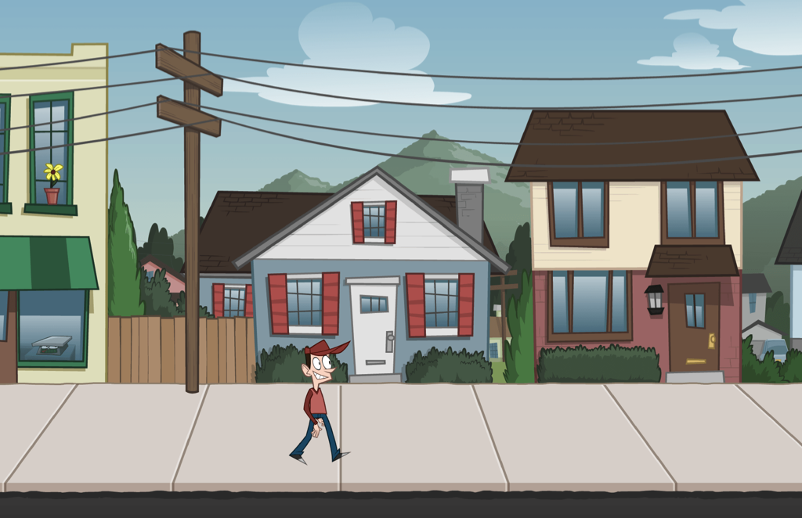

# Using sprite sheets in melonJS

A simple project showing how to use sprite sheets and animations in melonJS.

A complete tutorial is available here: [Using sprite sheets in melonJS](https://www.codeandweb.com/texturepacker/tutorials/using-sprite-sheets-with-melonjs-tutorial)

## Tutorial Content

* Learn why you should use sprite sheets in your melonJS game
* Use TexturePacker to create a sprite sheet
* Optimize the sprite sheet: Faster startup for your game
* Use static images (background)
* Use animations

